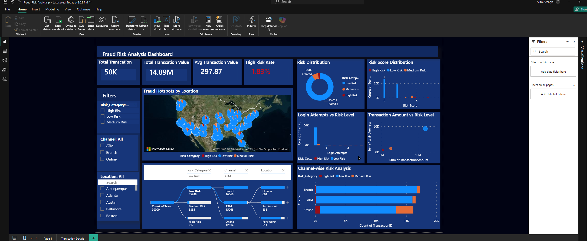
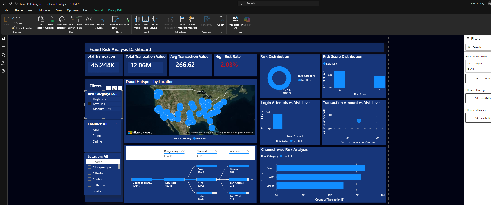

# 🚨 Fraud-Risk-Analysis

## 📝 Project Overview

Financial institutions process thousands of transactions every day across channels such as ATM, Online, and Branch, which makes detecting suspicious transactions one of the biggest challenges in fraud monitoring.

I wanted to build a solution that could help identify elevated-risk transactions more effectively using behavioral indicators such as repeated login attempts, transaction amount, and transaction channels.

To work on this problem, I used a transaction-level fraud dataset from Kaggle containing transaction activity, login behavior, channel information, and geographic data. I cleaned and prepared the dataset using Python and Power BI, then used SQL and Power BI to analyze fraud patterns, measure risk exposure, and visualize high-risk activity through an interactive dashboard.

---

## 🔍 What I Did

- To build a solution for fraud risk monitoring, I searched for transaction-level financial data containing transaction amount, login behavior, transaction channel activity, and geographic information that could help identify suspicious transaction patterns and elevated-risk activity.

- After finding a suitable dataset from Kaggle, I cleaned and prepared the data using Python and Power BI by fixing formatting inconsistencies, validating transaction fields, and preparing the dataset for analysis and visualization.

- I then created transaction risk indicators using login attempts, transaction amount, and transaction channel activity to classify transactions into Low Risk, Medium Risk, and High Risk categories.

- Using SQL and Power BI, I analyzed fraud patterns across channels, locations, behavioral activity, and financial exposure, then built an interactive dashboard in Power BI to visualize fraud hotspots and support fraud monitoring decisions.

---

## 🛠️ How I Did It

- **Python:** Cleaned the raw transaction file by checking column consistency, fixing formatting issues, and preparing the dataset before loading it into SQL Server and Power BI.

- **Power BI / Power Query:** Fixed the `TransactionDate` formatting issue, where date values were not reading correctly, and converted the field into a proper Date/Time format for time-based analysis.

- **DAX:** Created `Risk_Score` using transaction amount, login attempts, and channel activity to identify elevated-risk transactions. Transactions received weighted risk points when the transaction amount exceeded 500, login attempts were greater than 2, or the transaction occurred through the Online channel, since these behaviors are commonly associated with higher fraud exposure and suspicious activity patterns.

- **DAX:** Created `Risk_Category` from the `Risk_Score` to classify transactions into Low Risk, Medium Risk, and High Risk categories using `SWITCH(TRUE())` logic. Transactions with higher combined scores were treated as higher-priority cases for monitoring and investigation.

- **SQL Server:** Applied the same transaction risk logic in SQL using `CASE WHEN` statements to perform deeper analytical queries, then used aggregation, percentage calculations, and grouping functions to analyze fraud risk across channels, locations, login behavior, and financial exposure.

- **Power BI:** Built an interactive fraud monitoring dashboard using KPI cards, geographic fraud hotspot mapping, risk distribution analysis, decomposition tree investigation, channel-wise risk analysis, login behavior analysis, transaction amount vs risk analysis, and interactive slicers to support transaction investigation and fraud monitoring decisions.

---

## 🧰 Tools & Technologies

- SQL Server (T-SQL)
- Power BI
- Python

---

## 🏆 What I Achieved

- Identified that the Online channel had a 4.5% High Risk rate, significantly higher than ATM and Branch transactions, highlighting Online activity as the primary concentration area for elevated fraud exposure.

- Detected that transactions with more than two login attempts showed a sharp increase in High Risk classification, with risk percentages exceeding 60% in some scenarios, establishing login behavior as one of the strongest fraud indicators in the dataset.

- Reduced investigation focus from the full transaction population to only 1.83% High Risk transactions, helping create a more targeted and operationally manageable fraud review approach.

- Identified geographic areas with higher concentrations of high-risk transaction value, helping reveal geographic fraud hotspots that may require stronger monitoring controls.

- Revealed that financial exposure was not limited only to High Risk transactions, as Medium Risk activity also showed elevated average transaction values.

- Created a prioritized transaction review structure using transaction amount, behavioral activity, channel exposure, and geographic risk patterns to support faster fraud investigation and monitoring decisions.

---

## 💡 Recommendations

- Prioritize monitoring of Online transactions and elevated login attempt activity, as these showed the highest concentration of High Risk transactions in the analysis.

- Focus fraud investigation efforts on the smaller group of High Risk transactions instead of reviewing the entire transaction population equally, helping improve investigation efficiency and response time.

- Apply additional verification controls for transactions with repeated login attempts, since login behavior showed a strong relationship with elevated fraud risk.

- Use geographic risk patterns and financial exposure analysis to identify locations that may require stronger fraud monitoring controls.

- Monitor Medium Risk transactions closely alongside High Risk activity, as they showed elevated average transaction values and meaningful financial exposure.

---

## 🎓 What I Gained

- Hands-on experience working through a full analytics workflow, from data preparation and risk feature creation to SQL analysis and dashboard development.

- Practical experience using SQL analytical queries, DAX calculations, and Power BI visualizations to solve a business-focused fraud monitoring problem.

- Improved my ability to translate transaction-level data into operational insights that support investigation prioritization and fraud monitoring decisions.

- Strengthened my understanding of behavioral risk analysis, financial exposure analysis, and dashboard-driven investigation workflows.

---

## 🙋‍♀️ About Me

Hey! I’m Aliza Acharya. I recently completed my MS in Business Analytics at DePaul University and enjoy building data-driven projects using SQL, Power BI, Python, and analytics to solve business problems and support smarter decision-making.

I’m interested in data analytics, business intelligence, dashboard development, and using data to turn complex business problems into actionable insights. Let’s connect if you’d like to discuss analytics, dashboards, SQL, Power BI, or data-driven problem solving.

---

## 📁 Project Files

- [📊 Power BI Dashboard](Fraud_Risk_Analysis.pbix)

- [🗄️ SQL Analysis Script](Risk_Analysis.sql)

---
